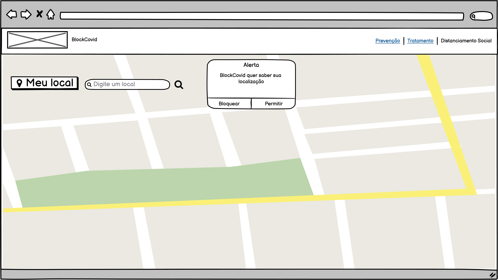
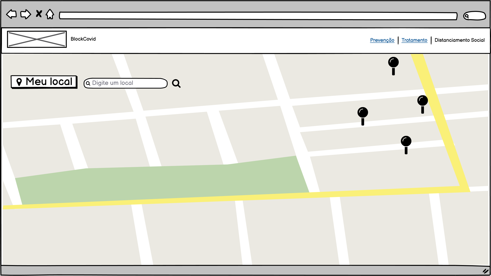
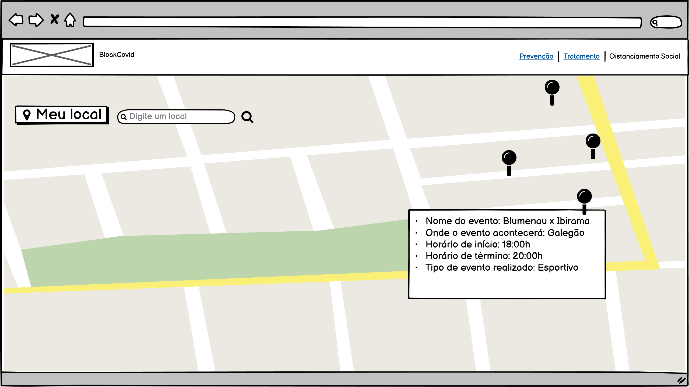

##  Documentação referente à funcionalidade "Mapeamento de aglomeração" do módulo "Isolamento e Distanciamento social"

### Objetivo:
O objetivo do mapeamento de aglomeração é indicar ao usuário, locais de potencial aglomeração de pessoas em torno de um ponto geográfico.

### Descrição:

Essa funcionalidade mostrará em um mapa os eventos sociais que ocorrerão na região do usuário. Será possível pesquisar através de um filtro por outras regiões caso o usuário deseje.
Ao acessar pela primeira vez o aplicativo, o browser solicitará ao usuário a autorização para acessar sua localização (conforme tela 01). Caso não haja autorização, o usuário pode pesquisar manualmente.
Haverá um botão chamado “Meu local” que por padrão trará os eventos de acordo com o GPS do usuário caso este tenha autorizado no dispositivo. Haverá também um input alfanumérico de pesquisa chamado “Digite um local” para que o usuário escolha uma região. Ao clicar no ícone de lupa a pesquisa será realizada. A pesquisa pelo botão de lupa visa melhorar a performance do aplicativo. 

### Detalhes técnicos:

A pesquisa dos eventos será via API do Facebook (Graph API - consultada pelo link: https://developers.facebook.com/docs/graph-api/reference/event/?locale=pt_BR. 

Os campos consultados e filtrados da API do facebook seriam:
- Identificação: ```id```
- Nome do evento: ```name``` 
- Localização: ```place```
- Início  do evento: ```start_time```
- Término do evento: ```end_time```
- Cancelamento do evento: ```is_canceled```
- Categorias do tipo de evento: ```category```
- Tipo de evento online ou presencial: ```is_online```

Para inicialização e centralização do mapa será utilizada a API Google Maps (consultada pelo link: https://developers.google.com/maps/documentation/javascript/overview) passando as informações do GPS recebidas pelo browser. 
Para a visualização do marcador correspondente à localização do evento no mapa, será repassado à API do Google Maps, as informações vindas da API do Facebook. 

Uma rotina de código seria construída para informar ao usuário, ao clicar no Pin do mapa, os seguintes detalhes (conforme tela 03):
    - Nome do evento
    - Onde o evento acontecerá
    - Horário de início
    - Horário de término
    - Tipo de evento realizado.
### Protótipos
Tela 01

Tela 02

Tela 03

