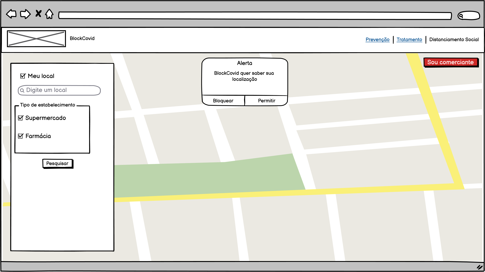
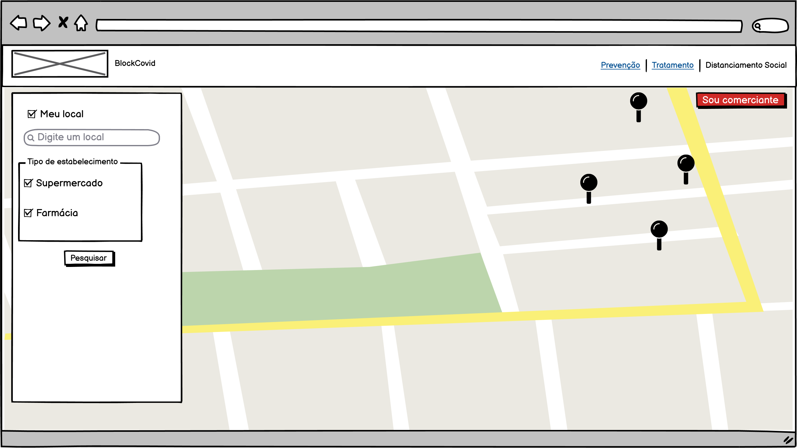
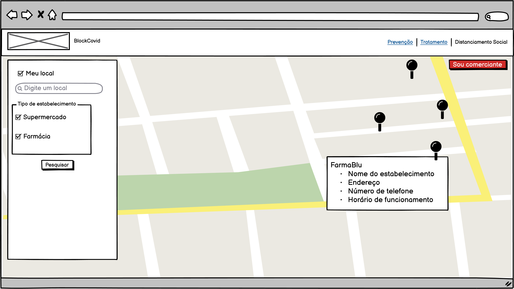
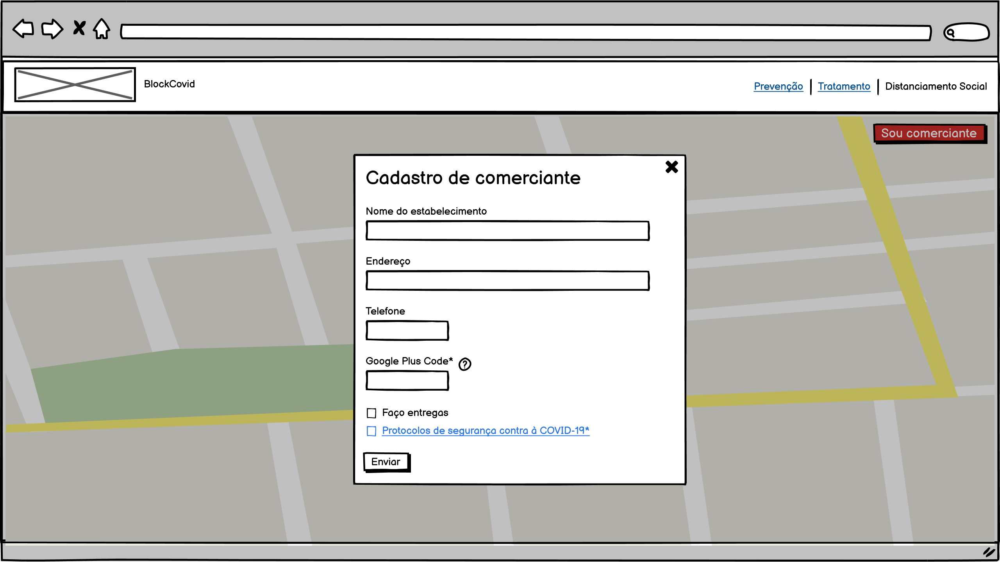

##  Documentação referente à funcionalidade "Mapa de locais úteis" do módulo "Isolamento e Distanciamento social"

### Objetivo:
O objetivo da funcionalidade de apresentar um mapa com locais úteis seria mostrar ao usuário os estabelecimentos próximos a ele que realizam entrega em domicílio. Possibilitando ao usuário consultar e consumir desses produtos mantendo um isolamento social, caso seja essa a necessidade,  ou apenas contribuir para o distanciamento social.

### Descrição:
Essa funcionalidade mostrará em um mapa, as farmácias e supermercados próximos à região do usuário. Sendo possível pesquisar por outras regiões também.
Somente serão mostrados no mapa os estabelecimentos cadastrados que seguem todos os protocolos de enfrentamento à COVID-19 e fazem entrega em domicílio.
Ao acessar pela primeira vez o aplicativo, o browser solicitará ao usuário a autorização para acessar sua localização (conforme tela 01). Caso não haja autorização, o usuário poderá pesquisar manualmente.
Haverá um botão chamado “Meu local” que por padrão trará os locais de acordo com o GPS do usuário caso este tenha autorizado no dispositivo. 
Para pesquisar e filtrar locais haverá um input alfanumérico de pesquisa chamado “Digite um local” para que o usuário escolha outra região e ao ser clicado desabilitará a opção "meu local". 
Na mesma área, haverá também uma checkbox com as opções "supermercado" e "farmácia" habilitadas por padrão. Caso o usuário deseje, pode desabilitar e realizar uma nova consulta somente com uma das opções (tela 02). 
Caso o usuário seja um comerciante, poderá cadastrar seu estabelecimento através do formulário do site acessando o botão "sou comerciante" (tela 04).  

### Detalhes técnicos:

Os dados fornecidos no formulário de cadastramento seriam armazenados em um banco de dados (MySQL).
Para inicialização e centralização do mapa será utilizada a API Google Maps (consultada pelo link: https://developers.google.com/maps/documentation/javascript/overview) passando as informações do GPS recebidas pelo browser. 
Para a visualização do marcador correspondente à localização do estabelecimento comercial no mapa, será repassado à API, o campo "plus code" (solicitado ao comerciante no preenchimento do formulário de cadastramento). Plus Codes são baseados em latitude e longitude e funcionam como endereços físicos.

Uma rotina de código seria construída para informar ao usuário, ao clicar no Pin do mapa, os seguintes detalhes (conforme tela 03):
- Nome do estabelecimento
- Endereço
- Número de telefone
- Horário de funcionamento

### Protótipos

Tela 01

Tela 02

Tela 03

Tela 04

