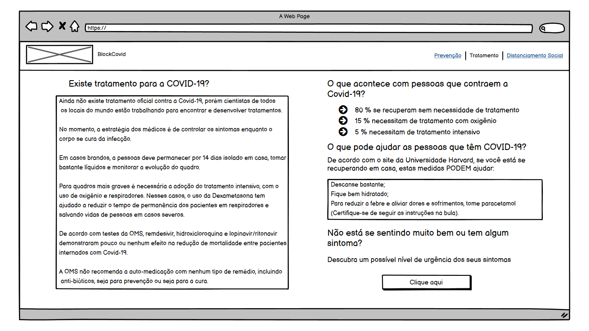

# Documentação
## Descrição:
* Essa funcionalidade tem como objetivo informar o usuário de como é ralizado atualmente o tratamento e o que pode ajudar com a COVID-19, além de oferecer um redirecionamento pra um teste a fim de saber a gravidade dos sintomas e qual a orientação adequada. 
* Foi implementada com a finalidade de informar e conscientizar o usuário de forma simples e direta à respeito de tratamentos de covid e o que é e não é verdade a respeito de certos medicamentos.
* Fontes da onde foram obtidas as informações:
  * OMS: https://www.who.int/emergencies/diseases/novel-coronavirus-2019/question-and-answers-hub/q-a-detail/coronavirus-disease-covid-19#:~:text=treatment
  * Harvard: https://www.health.harvard.edu/diseases-and-conditions/treatments-for-covid-19

## Detalhes técnicos:
Essa funcionalidade poderá ser implementada com HTML, CSS e JavaScript.

## Protótipo

