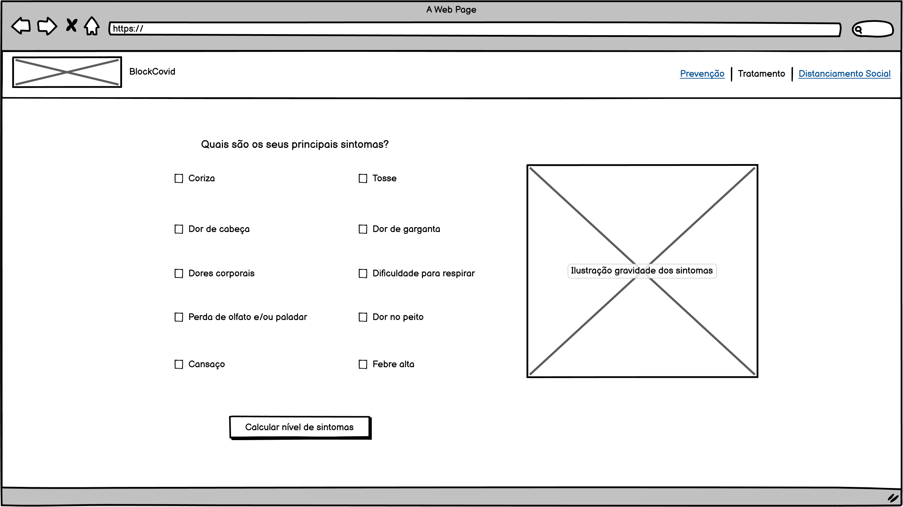
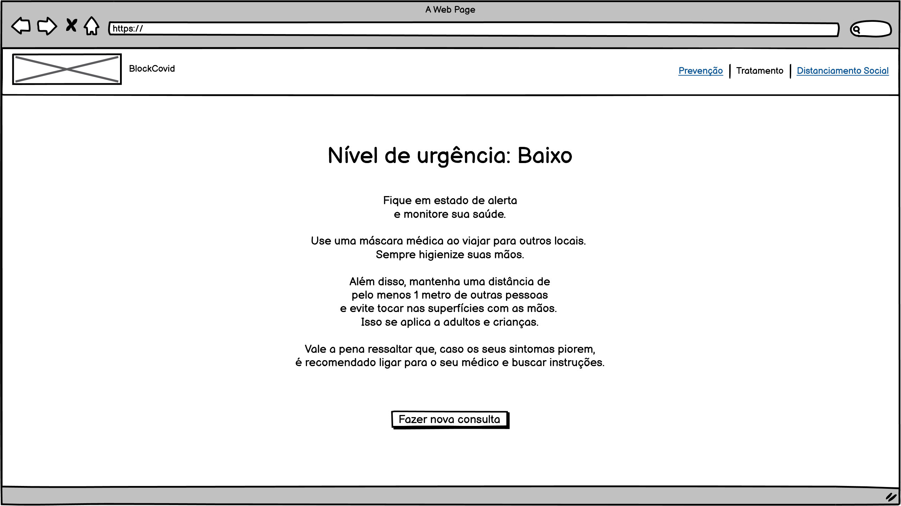
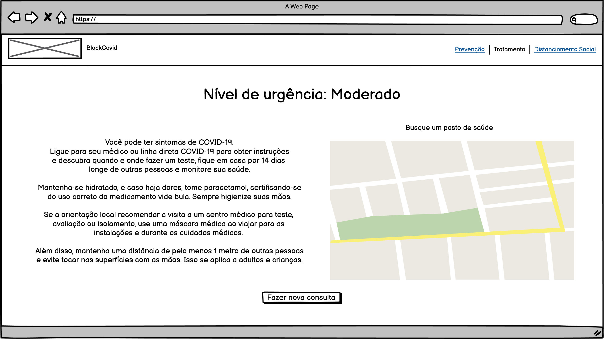
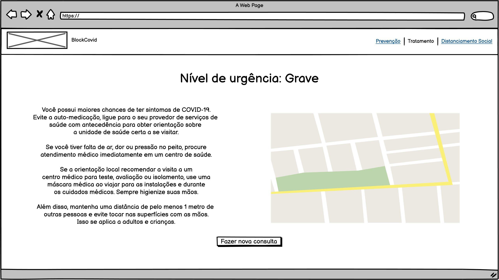

# Documentação
## Descrição:

* Essa funcionalidade tem como objetivo calcular os sintomas do usuário e oferecer um resultado sobre a urgência em fazer um teste de covid, visto que não é possível afirmar sem laudos médicos se o usuário contraiu covid ou não. Sendo de baixa urgência, será recomendado monitorar a saúde, utilizar máscaras e álcool em gel, e manter distanciamento social. Sendo de urgência moderada, será recomendado isolamento de 14 dias, hidratação e medicamento, além da busca de um posto de saúde mais próximo. Sendo de urgência grave, será recomendado a busca de um hospital mais próximo. A busca dos hospitais e postos de saúde será feita pela API do Google Maps.
* O cálculo é feito da seguinte maneira:
  * Sintomas graves de COVID-19: Dificuldade para respirar, dores no peito, febre alta.
  * Sintomas comuns de COVID-19: Tosse, cansaço, perda de olfato e/ou paladar
  * Sintomas não muito comuns de COVID-19: Coriza, dor de garganta, dor de cabeça, dores corporais
    * 3 sintomas quaisquer que não sejam nenhum dos GRAVES, é considerado LEVE.
    * Se tiver pelo menos um sintoma GRAVE e outros sintomas comuns ou não comuns da COVID-19, é MODERADO.
    * TODOS os sintomas GRAVES e mais os outros que forem marcados é GRAVE.

* Este processo foi implementado com a finalidade de instruir de maneira prática e com linguagem simples o usuário, sendo os processos recomendados a se seguir em um caso que há chances de ser sintomas de covid. Há também uma chance em analisar dados dos usuários, afim de que possa haver um controle sobre quantas pessoas tem chances de ter covid, por exemplo.

* Fontes da onde foram tiradas as informações:
  * OMS: https://www.who.int/emergencies/diseases/novel-coronavirus-2019/question-and-answers-hub/q-a-detail/coronavirus-disease-covid-19#:~:text=treatment
  * Harvard: https://www.health.harvard.edu/diseases-and-conditions/treatments-for-covid-19

## Detalhes técnicos:
* Essa funcionalidade poderá ser implementada com HTML, CSS e JavaScript. Com consulta a API do Google Maps.
A busca pelos postos de saúde ou hospitais será feita utilizando a geolocalização do usuário. 

## Protótipo

