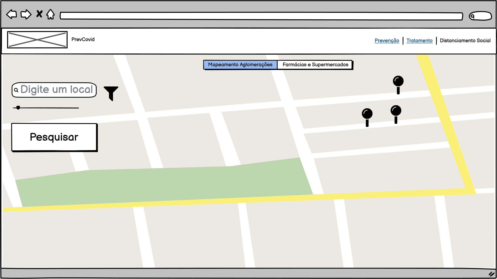

# Exemplo de Documentação
## Exemplo de Descrição:
Essa funcionalidade mostrará em um mapa os eventos sociais que ocorrerão na região do usuário. Também será possível pesquisar através de um filtro por outras regiões. A pesquisa dos eventos será via API do facebook e do mapa via via API de incorporação do google maps

## Exemplo de detalhes técnicos:
X poderia ser implementado da forma tal e tal. Usaria tal tecnologia com consulta a tal API (url tal) ou consulta a um BD. Se for API, será consultado os campos a, b e c e integrado nas rotinas do nosso código. 
Em relação ao filtro de pesquisa: haverá um campo chamado “raio” e esse campo poderá ser um input de texto ou slider que limitará a pesquisa na API. 
Em relação ao botão pesquisar: Ao clicar no botão será realizada a rotina de consulta à API. 

## Exemplo de dúvidas ou dificuldades que podem surgir: 
Relatar aqui possíveis obstáculos observados durante a pesquisa para implementação. Exemplos: 
- Limite de consulta da API
- Performance de consulta

## Protótipo

# Exemplo de sugestão:
- Adicionar um métrica de risco (baixa, média ou alta) a ser exibida para o usuário. 
