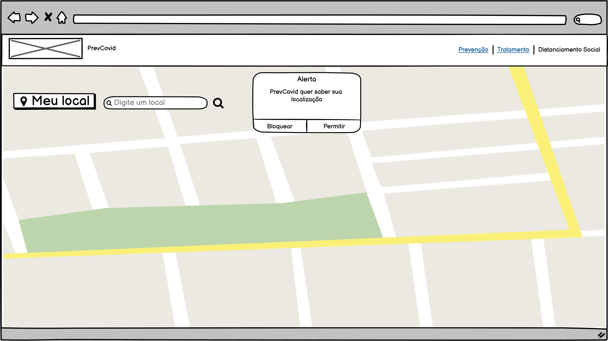
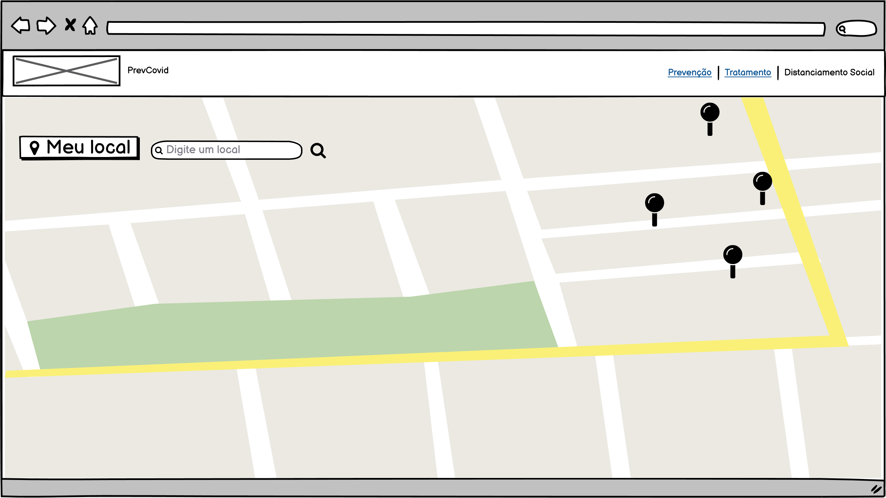
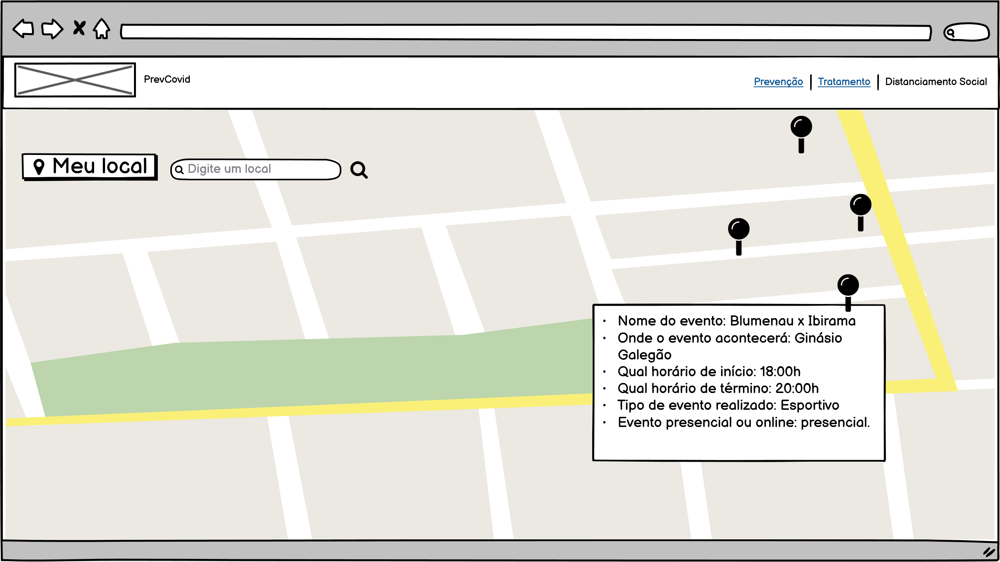

##  Documentação referente à funcionalidade "Mapeamento de aglomeração" do módulo "Isolamento e Distânciamento social"

### Objetivo:
O objetivo do mapeamento de aglomeração é indicar ao usuário locais de potencial aglomeração de pessoas em torno de um ponto geográfico.

### Descrição:

Essa funcionalidade mostrará em um mapa os eventos sociais que ocorrerão na região do usuário. Será possível pesquisar através de um filtro por outras regiões caso o usuário deseje.
A pesquisa dos eventos será via API do Facebook e a visualização do mapa será via API de incorporação do Google Maps. 
Ao acessar pela primeira vez o aplicativo, o browser solicitará ao usuário a autorização para acessar sua localização (conforme tela 01). Caso não haja autorização, o usuário pode pesquisar manualmente.

Haverá um botão chamado “Meu local” que por padrão trará os eventos de acordo com o GPS do usuário caso este tenha autorizado no dispositivo. Haverá também um input alfanumérico de pesquisa chamado “Digite um local” para que o usuário escolha uma região. Ao clicar no ícone de lupa a pesquisa será realizada. A pesquisa pelo botão de lupa visa melhorar a performance do aplicativo. 

### Detalhes técnicos:
A documentação da API do Facebook pode ser consultada pelo link: https://developers.facebook.com/docs/graph-api/reference/event/?locale=pt_BR.	

E a documentação da API do Google Maps pode ser consultada pelo link: https://developers.google.com/maps/documentation/javascript/overview.

Os campos consultados na API do facebook seriam:
- Nome do evento: ```name``` 
- Localização: ```place```
- Início  do evento: ```start_time```
- Término do evento: ```end_time```
- Cancelamento do evento: ```is_canceled```
- Categorias do tipo de evento: ```category```
- Tipo de evento online ou presencial: ```is_online```

Uma rotina de código seria construída para informar ao usário, ao clicar no Pin do mapa, os seguintes detalhes (conforme tela 03):
    - Nome do evento
    - Onde o evento acontecerá?
    - Qual horário de início e término?
    - Tipo de evento realizado.
    - Se o evento é presencial ou online.

### Protótipos
Tela 01

Tela 02

Tela 03

