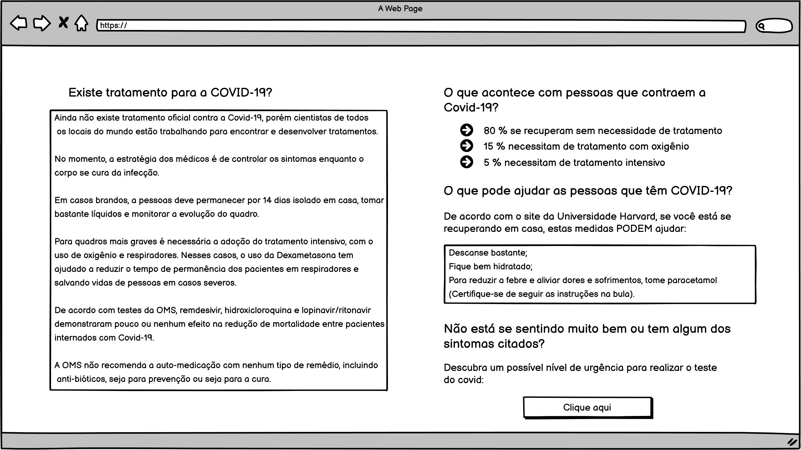

# Documentação
## Descrição:
Essa funcionalidade tem como objetivo informar o usuário dos sintomas, possível tratamento e o que pode ajudar com a COVID-19, além de oferecer um teste para saber a gravidade dos sintomas.

## Detalhes técnicos:
Essa funcionalidade poderá ser implementada com HTML, CSS e JavaScript.

## Protótipo

