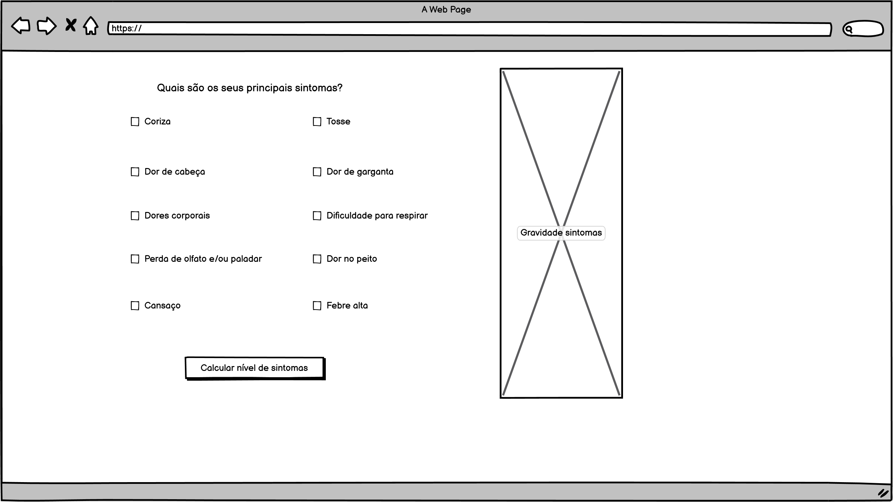
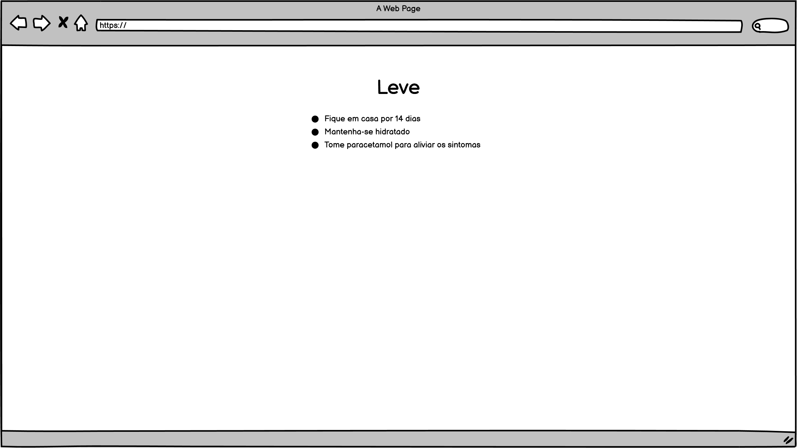
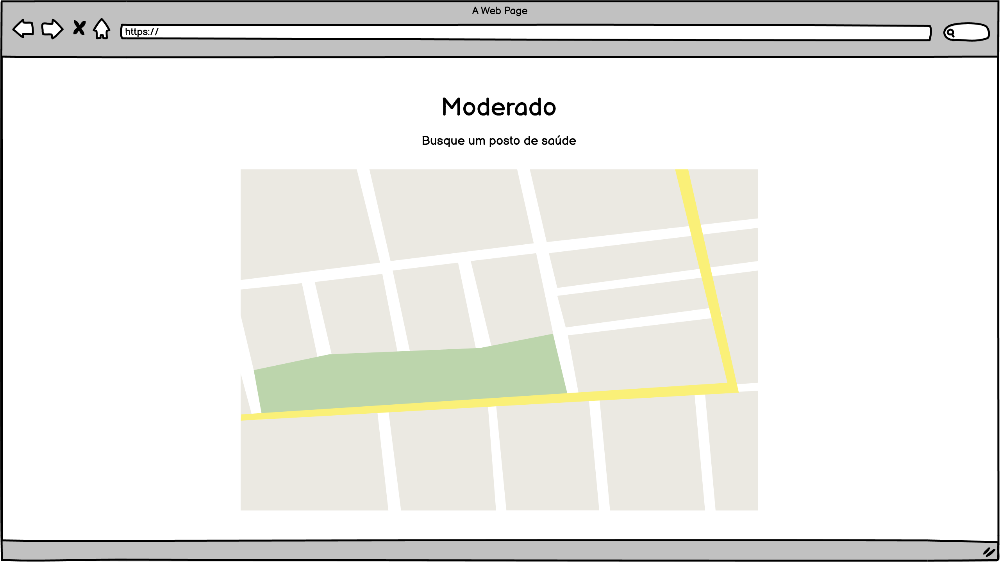
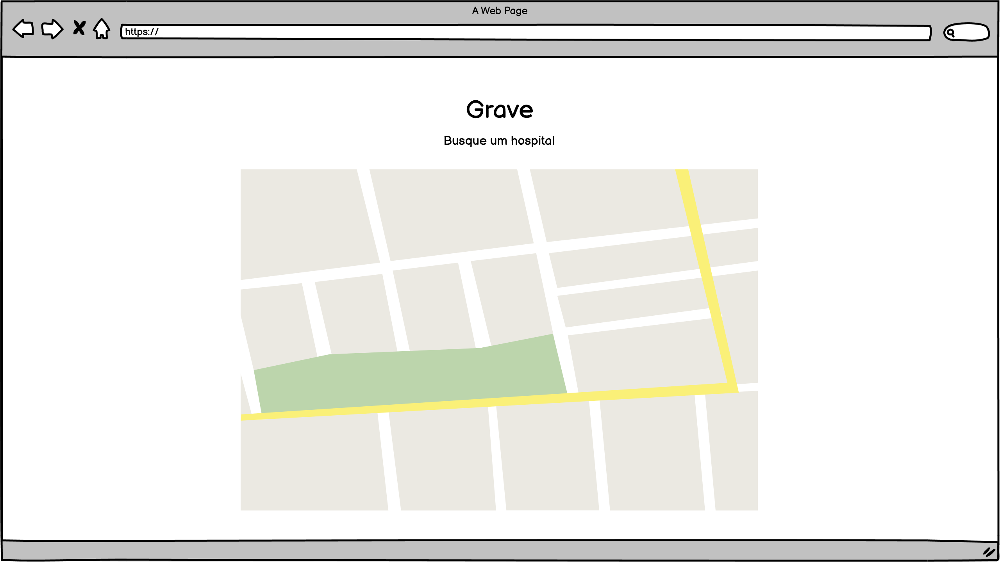

# Documentação
## Descrição:
* A primeira funcionalidade seria um "Quadro de informações", no qual são trazidas informações referentes à tratamento, dicas e principais sintomas do COVID-19.
Na mesma tela, caso o usuário não esteja se sentindo bem, ele tem a opção de, por meio de um botão na tela, ser direcionado a outra tela que irá determinar a urgência para realizar um teste de covid.

* Esta segunda funcionalidade tem como objetivo calcular os sintomas do usuário e oferecer um resultado sobre a urgência em fazer um teste de covid, visto que não é possível afirmar sem laudos médicos se o usuário contraiu covid ou não. Sendo de baixa urgência, será recomendado monitorar a saúde, utilizar máscaras e álcool em gel, e manter distanciamento social. Sendo de urgência moderada, será recomendado isolamento de 14 dias, hidratação e medicamento, além da busca de um posto de saúde mais próximo. Sendo de urgência grave, será recomendado a busca de um hospital mais próximo. A busca dos hospitais e postos de saúde será feita pela API do Google Maps.

## Detalhes técnicos:
* Essa funcionalidade poderá ser implementada com HTML, CSS e JavaScript. Com consulta a API do Google Maps.
A busca pelos postos de saúde ou hospitais será feita utilizando a geolocalização do usuário. 

## Protótipo

